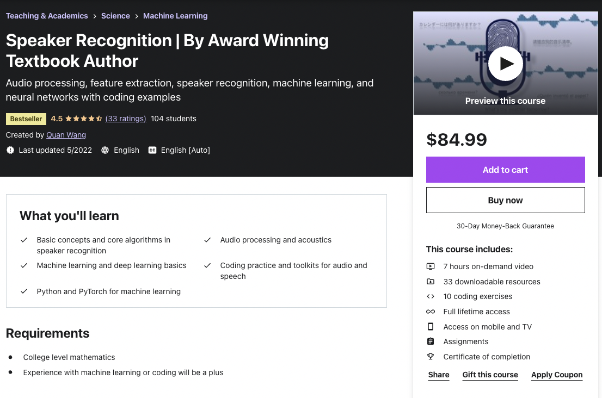

# Speaker Recognition From Scratch

## Overview

This is the reference code for the final project of the [Speaker Recognition course on Udemy](https://www.udemy.com/course/speaker-recognition/?referralCode=1914766AF241CE15D19A).

[](https://www.udemy.com/course/speaker-recognition/?referralCode=1914766AF241CE15D19A)

In this project, we will build an LSTM-based speaker recognition system from scratch.

We will train the neural network on [LibriSpeech](https://www.openslr.org/12), and evaluate the Equal Error Rate (EER).

The system is built on top of [PyTorch](https://pytorch.org/tutorials/) and [librosa](https://librosa.org/doc/latest/index.html) - we have already learned both in the course.

## Disclaimers

The purpose of this project is to build a **minimal working system** using simple Python code, to help students learn the basic concepts. Many details have been largely simplified to make the code easier to understand.

* We are NOT trying to build a state-of-the-art system.
* We are NOT trying to use best software engineering practice.
* We will NOT make use of many advanced library or features that are frequently used in academia and industry.

## How to use

### Try building your own system first

**If you just started this project, please STOP here!**

The lectures and practices in the [course](https://www.udemy.com/course/speaker-recognition/?referralCode=1914766AF241CE15D19A) already covered all the necessary knowledge and skills for you to build your own speaker recognition system from scratch.

So, before you dive into this library, you should try to build your own speaker recognition system first. If you are stuck, go back to the lectures, coding exercises, and assignments, to see what is missing. This may take long, and you may struggle at the beginning. But believe me, this process will really help you master what you have learned in this course.

If you are still clueless after trying hard, then don't worry, this library serves as a template for you to get started. You can read this library first as a reference, then build your own system from scratch. You can also use this library as a starting point, and implement alternative algorithms - in the final project, we will list a few ideas for you to try.

### Understand the file structure

* `myconfig.py`: all the configurations of this library
* `feature_extraction.py`: code for extracting acoustic features with librosa
* `neural_net.py`: code for building neural networks and training with PyTorch
* `evaluation.py`: code for inference and evaluation
* `tests.py`: unit tests

### Download the data

Go to the [OpenSLR website](https://www.openslr.org/12), and download LibriSpeech datasets.

For simplicity, we will start with the smallest training set and test set, e.g. `train-clean-100.tar.gz` and `test-clean.tar.gz`.

After downloading them, unzip these files on your disk.

### Update configurations

All the configurations are in `myconfig.py`.

First, you need to update `TRAIN_DATA_DIR` and `TEST_DATA_DIR` to point to where you have unzipped your LibriSpeech datasets.

For example, on my computer, these will be:

* `TRAIN_DATA_DIR = "/home/quan/Code/github/SpeakerRecognitionFromScratch/data/LibriSpeech/train-clean-100"`
* `TEST_DATA_DIR = "/home/quan/Code/github/SpeakerRecognitionFromScratch/data/LibriSpeech/test-clean"`

Next, update `SAVED_MODEL_PATH` to where you will be saving your trained neural networks. The file name should end with `.pt`, which is a common PyTorch convention.

### Install dependencies

Install the required dependencies first by running this command:

```
pip3 install -r requirements.txt
```

### Run unit tests

To make sure you have the right dependencies and configured the downloaded data  correctly, run the unit tests with this command:

```
python3 tests.py
```

If you see something like:

```
Ran ... tests in ...s

OK
```

It means all the tests passed. You are good to go!

Otherwise, use the failure messages to fix the issues.

### Train a model

Next, you can start training a speaker encoder model by running:

```
python3 neural_net.py
```

Before you run this command, you can update `myconfig.py` again to adjust some parameters. For example, you can update `TRAINING_STEPS` to indicate how many steps you want to train. This library is not being optimized for efficiency, so training could be very slow.

Once training is done, the trained network will be saved to disk, based on the path specified by `SAVED_MODEL_PATH` in `myconfig.py`.

If the training is too slow for you, you can also proceed to the next step using the models that I pretrained for you, located in `saved_model/pretrained`.

### Evaluate your model

Once the model has been trained and saved to disk, you can evaluate the Equal Error Rate (EER) of this model on the test data.

Run this command to run evaluation:

```
python3 evaluation.py
```

You can update `NUM_EVAL_TRIPLETS` in `myconfig.py` to control how many positive and negative trials you want to evaluate.

When the evaluation job finishes, the EER will be printed to screen, for example:

```
eer_threshold = 0.7320000000000005 eer = 0.101
```

This means the Equal Error Rate is 10.1%.

## What's next?

Like we said earlier, this is NOT a very good system. 10.1% is a very high EER.

There are many reasons, for example:

* Data: We are only using a small subset of LibriSpeech clean, this is very simple data, and with very few speakers. Also, no data augmentation is used.
* Feature: We are simply using default params of MFCC in librosa.
* Model: We are simply using 3 layers of LSTM.
* Loss: We are using a simple triplet loss.
* Efficiency: Code is written for simplicity and readability, not really for efficiency.

Good news is that at least we have a system working end-to-end. It hooks up with data, extracts features, defines a neural network, trains the network, and evaluates it, all successfully.

In this project, you will need to come up with ideas to improve the system, to make the EER much smaller.

Are you ready for this challenge?

## Ask a question

Please use the **Q&A** board on [Udemy](https://www.udemy.com/course/speaker-recognition/?referralCode=1914766AF241CE15D19A) to ask me questions.

I will NOT directly respond to emails or GitHub issues.